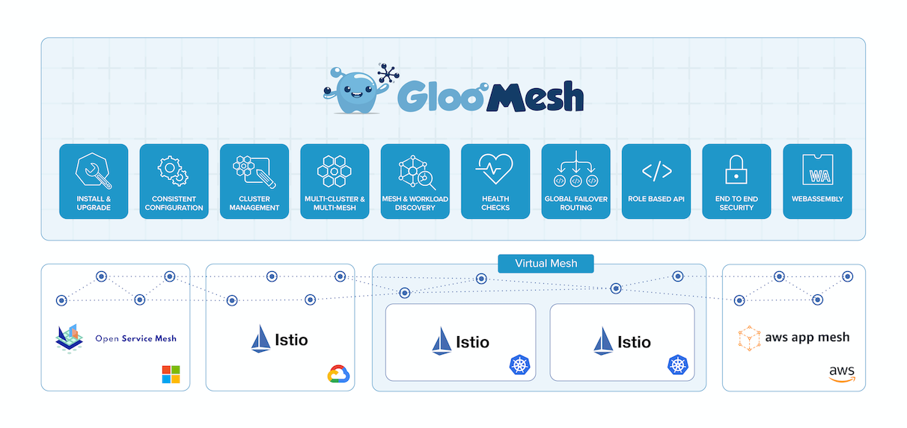

<h2 align="center">
    
     
</h2>

Gloo Mesh is a Kubernetes-native **management plane** that enables configuration 
and operational management of multiple heterogeneous service meshes across multiple 
clusters through a unified API. The Gloo Mesh API integrates with the leading 
service meshes and abstracts away differences between their disparate APIs, allowing 
users to configure a set of different service meshes through a single API. Gloo Mesh is engineered with a focus on its utility as an operational management 
tool, providing both graphical and command line UIs, observability features, and 
debugging tools.

Welcome to Gloo Mesh
- [Features](#features)
- [Community](#community)
- [Questions and Resources](#questions-and-resources)

## Features

### Multi-mesh and multi-cluster
A core feature of Gloo Mesh is its ability to configure and manage multiple 
service mesh deployments across multiple clusters. The Gloo Mesh API provides 
an abstraction that allows users to configure groups of meshes as a single entity 
without having to deal with the underlying network configuration complexities.

### Heterogeneous meshes
Gloo Mesh supports industry leading service mesh solutions. Its simple and 
powerful unified API allows users to easily utilize a variety of different service 
meshes without requiring expertise in any specific service mesh implementation.

### Simple and powerful API
Gloo Mesh offers an API that emphasizes simplicity and ease of use without 
sacrificing functionality. Inherently complex service mesh configuration concepts 
(such as network routing, access control, security, etc.) are presented in a coherent 
representation supported by detailed, exhaustive documentation.

## Community

Welcome to the Gloo Mesh Community! This is a project for people and companies interested in Gloo Mesh. The community is open to all so please feel free to share with colleagues and friends interested in learning more and getting involved.

### Code of Conduct
We believe in fostering an open and welcoming environment and pledge to ensure participation in this project and community is a harassment-free experience for everyone regardless of age, body size, disability, ethnicity, sex characteristics, gender identity and expression, level of experience, education, socio-economic status, nationality, personal appearance, race, religion, or sexual identity and orientation. 

Read the full [code of conduct](CODE_OF_CONDUCT.md) and contact support@solo.io to report any instances that violate the CoC or with any questions. 

### Contribution 
There are many ways to get involved in an open source community and contribute to the project. Watch [this talk](https://www.youtube.com/watch?v=VE-igex6Lz4) to learn more about the architecture and how it works. 
- **Code:** If you're looking to hack on service mesh, check out the code and the contribution guide [here](https://docs.solo.io/gloo-mesh/latest/contributing/) and look for the *good first issue* and *help wanted* labels in the GitHub issues. 
 - **Docs:** Contribute to the [Docs](docs/) or file issues for any docs bugs or requests [here](https://github.com/solo-io/gloo-mesh/issues). 
 - **Talks and Blogs:** If you are interested in writing or speaking about Gloo Mesh and would like access to content, images or help, [DM us here](https://solo-io.slack.com/archives/DHQ9J939V). Share your demos, tutorials and content back to the community.

## Questions and Resources
If you have questions, please join the [#Gloo-Mesh channel](https://solo-io.slack.com/archives/CJQGK5TQ8) in the community slack. More information is available on the [website](https://www.solo.io/products/gloo-mesh/) and in the [docs](https://docs.solo.io/gloo-mesh/latest) 
- Learn more about [Open Source at Solo.io](https://www.solo.io/open-source/)
- Follow us on Twitter [@soloio_inc](https://twitter.com/soloio_inc)
- Watch the [deep dive videos](https://www.youtube.com/playlist?list=PLBOtlFtGznBjr4E9xYHH9eVyiOwnk1ciK)

# Security

*Reporting security issues:* We take Gloo Mesh's security very seriously. If you've found a security issue or a potential security issue in Gloo Mesh, please DO NOT file a public Github issue, instead send your report privately to [security@solo.io](mailto:security@solo.io).
